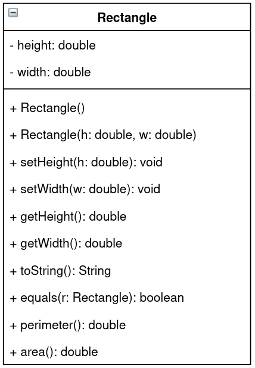

# First Exam

## Question One: Selection

Write a Java program that will prompt the user for a letter. If the letter is a vowel ('a', 'e', 'i', 'o', or 'u') print out "Vowel". If the letter is not a vowel, print out "Consonant".

## Question Two: Repetition

Write a Java program that will prompt the user to enter an integer and prints out every positive, odd integer less than or equal to that number. For example, if the user enters 6, the program would print out the following:

```
1 3 5
```

## Question Three: Arrays

Write a Java program that will prompt the user for 10 integers, which are stored in an array, and returns the integer that occurs the most frequently.

**NOTE:** 

- Your program must use an array.
- Do not sort the array or use ArrayLists.
- If multiple values occur equally many times, you only need to return one of them.

## Question Four: Objects

Write a Java class based on the following UML diagram. Include all standard methods, such as constructors, mutators, accessors, toString, and equals. Additionally, implement any methods shown in the diagram.



**NOTES:**

- Both `height` and `width` should only ever be positive (i.e. greater than 0).
- The perimeter of a rectangle is `2 * (height + width)`.
- The area of a rectangle is `height * width`.
