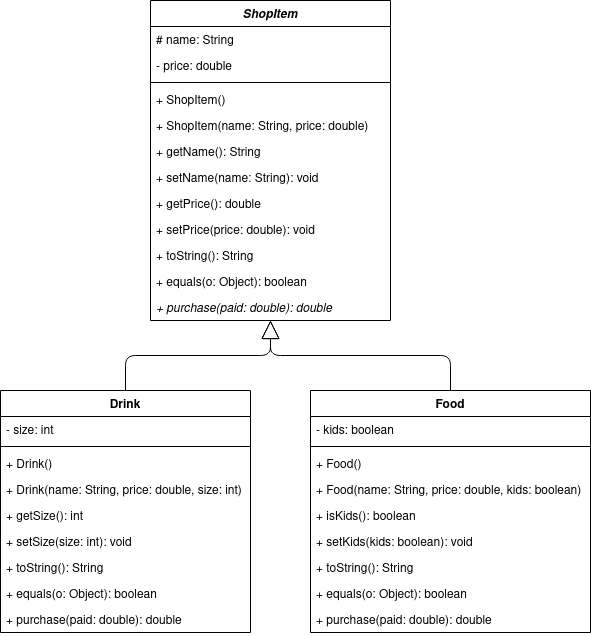

# Final Exam

You will have until July 31st at 07:00 CDT to complete this exam. It is opened notes and opened book, but all code must be your own (no answers found online will be accepted). Make sure to read all the instructions for each question carefully and answer each question completely. Once you have finished, please commit and push you work to your repository. Please also confirm that your code is in your remote repository, i.e. that it is on bitbucket.org.

No late submissions will be accepted.

## Question One: Inheritance/Polymorphism/Abstract Classes

Write the Java classes based on the following UML diagram. Include all methods and class as shown in the diagram.

**NOTES:**

* `price` can not be negative.
* `purchase` is taking the amount of money supplied by the customer. It should return the change they would receive from the transaction.
* In `Drink`, `size` should only be 1, 2, or 3.
* In `Drink`, `purchase` should multiple the price by the size. For example, a drink that has a price of `1.00` and a size of `2` would cost `2.00`.
* In `Food`, `purchase` should halve the price if it is for kids. For example, food that normally costs `1.00` would cost `0.50` if `kids` is true.



## Question Two: ArrayLists

Write a Java program that prompts the user to enter a sequence of words (Strings), storing them in an ArrayList, and continues prompting the user for words until they enter `"Done"`. When they have finished entering words, your program should print out each letter of the alphabet along with a count of how many words started with that letter (you may skip printing out letters that have a count of 0).

For example, if the user enters `{"Apple", "Banana", "Berry", "Cherry"}`, your program should print out the following:

```java
A - 1
B - 2
C - 1
```

## Question Three: Sorting

Write a Java program that implements Selection Sort for an Array (or ArrayList) of Strings (use the values below), sorting them by their length (i.e. "hello" (5) comes after "zoo" (3)) and prints out the sorted results.

```java
{"briefly", "mugwump", "articulation", "sync", "skein", "moire", "advisability", "varmint", "mandibular", "evergreen"}
```

## Question Four: Searching

Write a Java program that implements Sequential Search for an Array (or ArrayList) of numbers (use the values below) and allows the user to search for a value, printing the position that the value is found at. If the value is not present, it should print -1.

```java
{24, 87, 71, 73, 31, 65, 64, 13, 18, 8}
```
