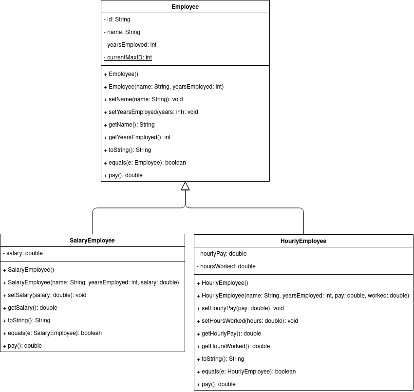

# Lab 3 - Inheritance/Polymorphism

## 07/09/2021

## Objectives

1. Be able to code a child class definition (inheritance)
2. Demonstrate knowledge of how to use the keyword _extends_
3. Demonstrate knowledge of how to code various non-default constructors using superclass constructors
4. Demonstrate knowledge of how to use super() in constructors
5. Demonstrate knowledge of how to use super in other subclass methods

## Exercises

In this assignment, you will be creating a class hierarchy to be used as part of an employee management application. The application will read in a list of 'employees' from a file and allow users to view current employees, create new ones, and remove existing ones. The application class will be detailed below, but the class hierarchy you should implement is as follows:

**NOTES**:

* The `id` for each employee should be 1 more than the last employee created. The last id value can be stored in `currentMaxID` which is a `static` variable.
* The `pay` methods should calculate the pay for each employee for the week. For `Employee`, just return `0`. For `SalaryEmployee`, return their salary divided by 52. For `HourlyEmployee`, return their hourly wage times the number of hours worked (this method should also reset the hours worked to 0 after calculating it).
* The data file follows the format `{name},{years employed},{type of employee},{pay}`.

### Employee Management Application

Your EmployeeManagementApplication should consist of at least the following methods:

* `readExistingFile` - This method should read in `employee.csv`, construct the correct `Employee` instance, and return an array of `Employee`s.
* `removeEmployee` - This method should take the array of `Employee`s and ask the user which employee should be removed.
* `addEmployee` - Creates a new `Employee` and adds it to the array of `Employee`s.
* `main` - This method is the standard main method and should contain the menu of options for the user and call all the other methods.
