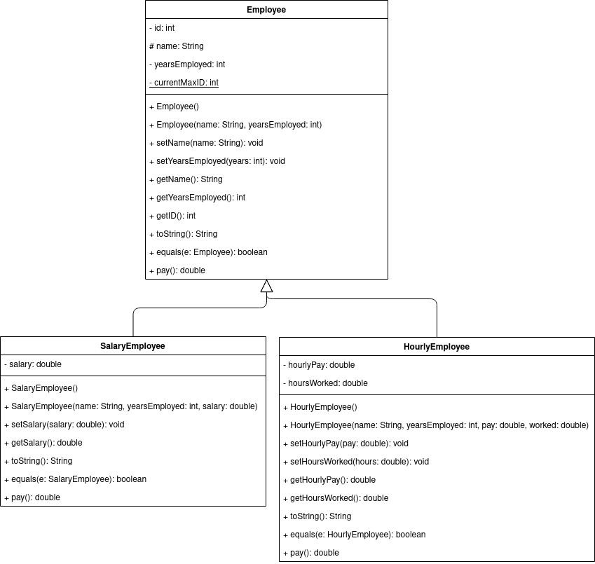

# Lab 4 - Lists

## 07/16/2021

## Objectives

1. Learn to write and use an ArrayList declaration
2. Learn to manipulate the data in an ArrayList

## Exercise

In this assignment, you will take your solution to the previous lab (Lab 3) and modify it to use an ArrayList instead of an array. In addition to the three required menu options from the previous lab (4 if you count 'Exit'), your program should now also allow the user to lookup an employee by name to see only their details and an option to edit an existing employee (i.e. choose an employee and modify one of their attributes). As a result, your application class's menu should look something like this:

```
1. List All Employees
2. Lookup An Employee
3. Create New Employee
4. Edit An Employee
5. Remove an Employee
6. Exit
```

These menu options can be in any order and can have different names (as long as they are sensible). You are also welcome to add additional menu options, but these 6 are required.

Additionally, I've included an updated version of the UML diagram, to correctly show the type for `id` and include a getter for it (still no setter as it should only be set once when the Employee is created). Feel free to update your implementation of these classes as part of this assignment, but they are not the focus.


